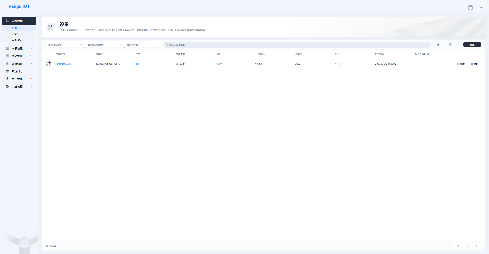
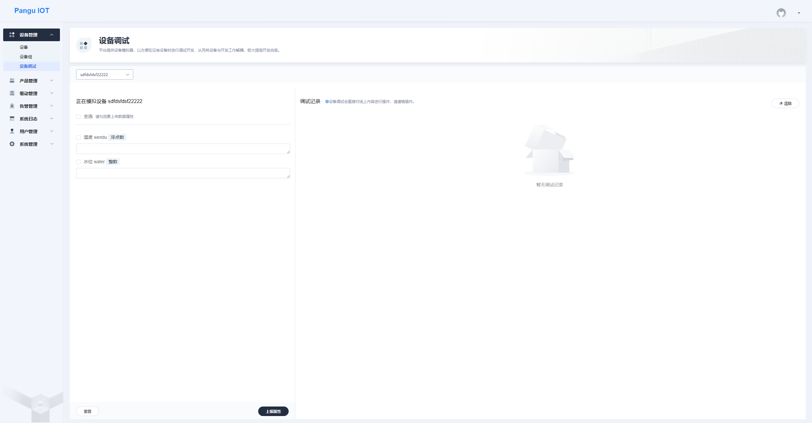
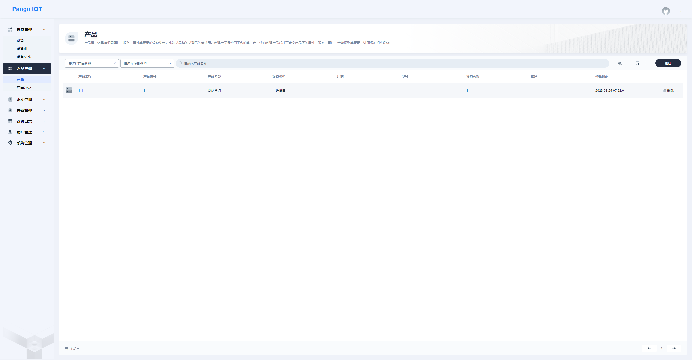
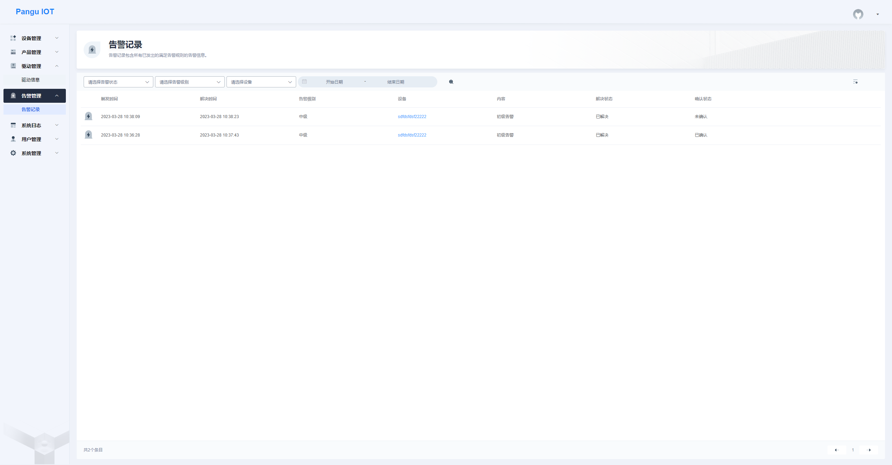
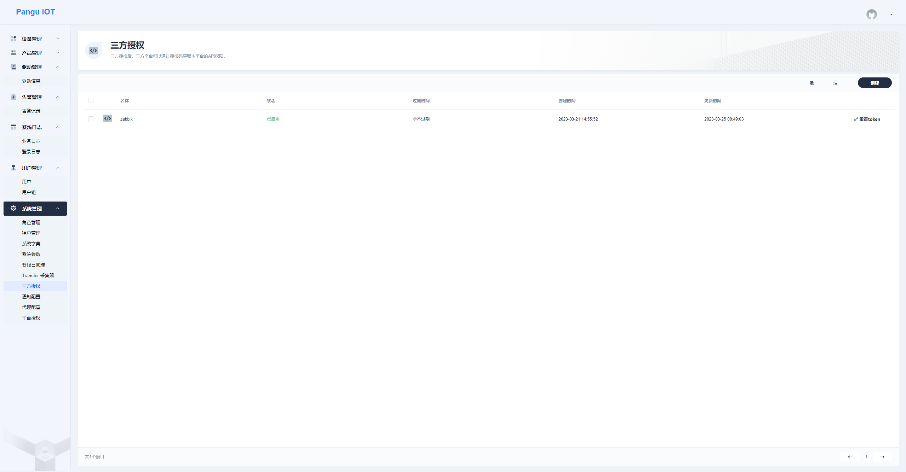

# pangu-iot-cloud 

盘古分布式物联网系统是基于 Spring Cloud 的开源可分布式物联网 (IOT) 平台,用于快速开发、部署物联设备接入项目,是一整套物联系统解决方案。

# 主要技术

# 前端

前端代码仓库: https://github.com/chengliang4810/pangu-iot-ui

# 预览图

# 项目结构
~~~ 
pangu-iot-cloud
├─ pangu-api             // api模块
│  └─ pangu-api-bom                // api模块依赖管理
│  └─ pangu-api-resource           // 资源api模块
│  └─ pangu-api-system             // 系统api模块
├─ pangu-auth           // 通用模块 [9210]
├─ pangu-common         // 通用模块
│  └─ pangu-common-alibaba-bom     // alibaba 依赖管理
│  └─ pangu-common-bom             // common 依赖管理
│  └─ pangu-common-core            // 核心功能模块
│  └─ pangu-common-dict            // 字典集成模块
│  └─ pangu-common-doc             // 文档集成模块
│  └─ pangu-common-dubbo           // dubbo集成模块
│  └─ pangu-common-elasticsearch   // ES集成模块
│  └─ pangu-common-encrypt         // 数据加解密模块
│  └─ pangu-common-excel           // excel集成模块
│  └─ pangu-common-idempotent      // 幂等功能模块
│  └─ pangu-common-job             // job定时任务集成模块
│  └─ pangu-common-loadbalancer    // 团队负载均衡集成模块
│  └─ pangu-common-log             // 日志集成模块
│  └─ pangu-common-logstash        // elk日志集成模块
│  └─ pangu-common-mail            // 邮件集成模块
│  └─ pangu-common-mybatis         // mybatis数据库相关集成模块
│  └─ pangu-common-oss             // oss相关集成模块
│  └─ pangu-common-prometheus      // prometheus监控
│  └─ pangu-common-redis           // redis集成模块
│  └─ pangu-common-satoken         // satoken集成模块
│  └─ pangu-common-seata           // seata分布式事务集成模块
│  └─ pangu-common-security        // 框架权限鉴权集成模块
│  └─ pangu-common-sentinel        // sentinel集成模块
│  └─ pangu-common-skylog          // skywalking日志收集模块
│  └─ pangu-common-sms             // 短信集成模块
│  └─ pangu-common-translation     // 通用翻译功能
│  └─ pangu-common-web             // web服务集成模块
├─ pangu-gateway        // 网关模块 [8080]
├─ pangu-iot            // 物联网模块
│  └─ pangu-iot-data               // IOT数据模块 [7202]
│  └─ pangu-iot-manager            // IOT管理模块 [7201]
├─ pangu-iot-driver     // 驱动模块
│  └─ pangu-iot-modbus-tcp-driver  // modbus-tcp协议驱动
├─ pangu-modules        // 功能模块
│  └─ pangu-gen                    // 代码生成模块 [9202]
│  └─ pangu-job                    // 任务调度模块 [9203,9901]
│  └─ pangu-resource               // 资源模块 [9204]
│  └─ pangu-system                 // 系统模块 [9201]
├─ pangu-visual         // 可视化模块
│  └─ pangu-monitor                // 服务监控模块 [9100]
│  └─ pangu-nacos                  // nacos服务模块 [8848,9848,9849]
│  └─ pangu-seata-server           // seata服务模块 [7091,8091]
│  └─ pangu-sentinel-dashboard     // sentinel控制台模块 [8718]
│  └─ pangu-xxl-job-admin          // 任务调度控制台模块 [9900]
├─ pangu-ui             // 前端框架 [80]
├─ config/nacos         // nacos配置文件(需复制到nacos配置中心使用)
│  └─ sentinel-pangu-gateway.json  // sentinel对接gateway限流配置文件
│  └─ seata-server.properties      // seata服务配置文件
│  └─ application.yml              // 所有应用主共享配置文件
│  └─ datasource.yml               // 所有应用共享数据源配置文件
│  └─ pangu-auth.yml               // auth 模块配置文件
│  └─ pangu-gateway.yml            // gateway 模块配置文件
│  └─ pangu-gen.yml                // gen 模块配置文件
│  └─ pangu-job.yml                // job 模块配置文件
│  └─ pangu-monitor.yml            // monitor 模块配置文件
│  └─ pangu-resource.yml           // resource 模块配置文件
│  └─ pangu-system.yml             // systen 模块配置文件
│  └─ pangu-sentinel-dashboard.yml // sentinel 控制台 模块配置文件
│  └─ pangu-xxl-job-admin.yml      // xxljob 控制台 模块配置文件
├─ config/grafana       // grafana配置文件(需复制到grafana使用)
│  └─ Nacos.json                        // Nacos监控页面
│  └─ SLS JVM监控大盘.json               // JVM监控页面
│  └─ Spring Boot 2.1 Statistics.json   // SpringBoot监控页面
├─ sql                  // sql脚本
│  └─ ry-cloud.sql                 // 主sql文件
│  └─ ry-config.sql                // 配置中心sql文件
│  └─ ry-job.sql                   // 任务调度sql文件
│  └─ ry-seata.sql                 // 分布式事务sql文件
├─ docker               // docker 配置脚本
│  └─ nacos                        // nacos配置文件
│  └─ nginx                        // nginx配置文件
│  └─ redis                        // redis配置文件
│  └─ seata                        // seata配置文件
│  └─ deploy.sh                    // 运行脚本
│  └─ docker-compose.yml           // docker编排文件
├─ .editorconfig        // 编辑器编码格式配置
├─ pom.xml              // 公共依赖
├─ README.md            // 框架说明文件
~~~

